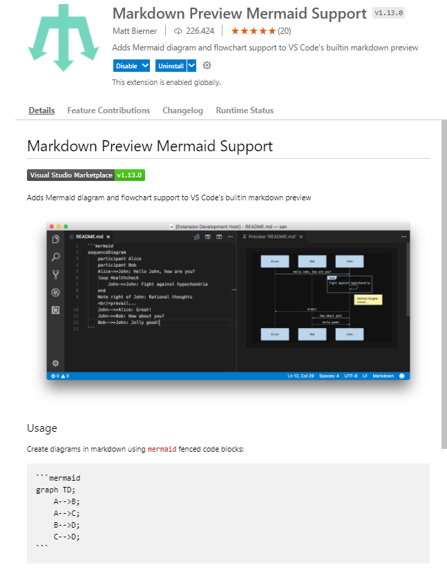

# 1. Ejemplo de uso de código declarativo `Mermaid` en Visual Studio Code

- [1. Ejemplo de uso de código declarativo `Mermaid` en Visual Studio Code](#1-ejemplo-de-uso-de-código-declarativo-mermaid-en-visual-studio-code)
  - [1.1. About Mermaid](#11-about-mermaid)
  - [1.2. Extensiones requeridas:](#12-extensiones-requeridas)
  - [1.3. Flowcharts](#13-flowcharts)
  - [1.4. Pie Chart](#14-pie-chart)
  - [1.5. Sequence diagram](#15-sequence-diagram)
  - [1.6. Gantt diagram](#16-gantt-diagram)
  - [1.7. State diagrams](#17-state-diagrams)
    - [1.7.1. Composite states](#171-composite-states)
    - [1.7.2. Choice](#172-choice)
    - [1.7.3. Forks](#173-forks)
    - [1.7.4. Concurrency](#174-concurrency)
  - [1.8. Class diagram](#18-class-diagram)
  - [1.9. Requirement Diagram](#19-requirement-diagram)
  - [1.10. Git graph - (experimental)](#110-git-graph---experimental)
  - [1.11. Entity Relationship Diagram - (experimental)](#111-entity-relationship-diagram---experimental)
  - [1.12. User Journey Diagram](#112-user-journey-diagram)


## 1.1. About Mermaid

[About Mermaid](https://mermaid-js.github.io/mermaid/#/)

## 1.2. Extensiones requeridas:





## 1.3. Flowcharts


---

## 1.4. Pie Chart


---

## 1.5. Sequence diagram


---

## 1.6. Gantt diagram
<mark>MARCADO</mark>


---

## 1.7. State diagrams


### 1.7.1. Composite states


### 1.7.2. Choice


### 1.7.3. Forks


### 1.7.4. Concurrency


---

## 1.8. Class diagram


---

## 1.9. Requirement Diagram

```mermaid
requirementDiagram

    requirement test_req {
    id: 1
    text: the test text.
    risk: high
    verifymethod: test
    }

    element test_entity {
    type: simulation
    }

    test_entity - satisfies -> test_req
```

```mermaid
requirementDiagram

    requirement test_req {
    id: 1
    text: the test text.
    risk: high
    verifymethod: test
    }

    functionalRequirement test_req2 {
    id: 1.1
    text: the second test text.
    risk: low
    verifymethod: inspection
    }

    performanceRequirement test_req3 {
    id: 1.2
    text: the third test text.
    risk: medium
    verifymethod: demonstration
    }

    interfaceRequirement test_req4 {
    id: 1.2.1
    text: the fourth test text.
    risk: medium
    verifymethod: analysis
    }

    physicalRequirement test_req5 {
    id: 1.2.2
    text: the fifth test text.
    risk: medium
    verifymethod: analysis
    }

    designConstraint test_req6 {
    id: 1.2.3
    text: the sixth test text.
    risk: medium
    verifymethod: analysis
    }

    element test_entity {
    type: simulation
    }

    element test_entity2 {
    type: word doc
    docRef: reqs/test_entity
    }

    element test_entity3 {
    type: "test suite"
    docRef: github.com/all_the_tests
    }


    test_entity - satisfies -> test_req2
    test_req - traces -> test_req2
    test_req - contains -> test_req3
    test_req3 - contains -> test_req4
    test_req4 - derives -> test_req5
    test_req5 - refines -> test_req6
    test_entity3 - verifies -> test_req5
    test_req <- copies - test_entity2
```

---

## 1.10. Git graph - (experimental)

```mermaid
gitGraph:
options
{
    "nodeSpacing": 150,
    "nodeRadius": 10
}
end
commit
branch newbranch
checkout newbranch
commit
commit
checkout master
commit
commit
merge newbranch
```

---

## 1.11. Entity Relationship Diagram - (experimental)

```mermaid
erDiagram
    CUSTOMER ||--o{ ORDER : places
    ORDER ||--|{ LINE-ITEM : contains
    CUSTOMER }|..|{ DELIVERY-ADDRESS : uses
```

```mermaid
erDiagram
    CUSTOMER ||--o{ ORDER : places
    CUSTOMER {
        string name
        string custNumber
        string sector
    }
    ORDER ||--|{ LINE-ITEM : contains
    ORDER {
        int orderNumber
        string deliveryAddress
    }
    LINE-ITEM {
        string productCode
        int quantity
        float pricePerUnit
    }
```

```mermaid
erDiagram
    CAR ||--o{ NAMED-DRIVER : allows
    CAR {
        string registrationNumber
        string make
        string model
    }
    PERSON ||--o{ NAMED-DRIVER : is
    PERSON {
        string firstName
        string lastName
        int age
    }
```

---

## 1.12. User Journey Diagram

```mermaid
journey
    title My working day
    section Go to work
      Make tea: 5: Me
      Go upstairs: 3: Me
      Do work: 1: Me, Cat
    section Go home
      Go downstairs: 5: Me
      Sit down: 5: Me
```

